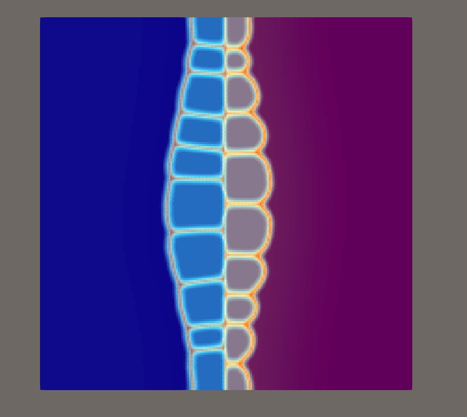

# Multiphase-Field Simulation of Al–Mg Intermetallic Compound Evolution

> **⚠️ Disclaimer — Toy Model**
>
> This repository is an informal reimplementation of the multiphase-field framework described in Raza & Klusemann (2020). It is intended as a learning exercise and a starting point for further development. **The model parameters have not been thermodynamically calibrated**: the CALPHAD free-energy polynomials are rough approximations, the interface energies and mobilities are not fitted to experimental data, and no quantitative comparison with physical measurements has been performed. This is a toy model — it qualitatively reproduces IMC grain growth morphology but should not be used to draw thermodynamic or kinetic conclusions.

A parallel MPI C implementation inspired by:

> Raza, S. H. & Klusemann, B. (2020). *Multiphase-field modeling of temperature-driven intermetallic compound evolution in an Al-Mg system for application to solid-state joining processes.* Modelling and Simulation in Materials Science and Engineering. https://doi.org/10.1088/1361-651X/aba1df



[](https://github.com/tianmengzhang841/almg-phasefield/releases/download/v1.0/almg.MP4)

---

## Background

Solid-state joining of Al and Mg alloys (e.g. Refill Friction Stir Spot Welding) produces a thin intermetallic compound (IMC) layer at the weld interface consisting of two phases: **β-Al₃Mg₂** and **γ-Al₁₂Mg₁₇**. The thickness and grain morphology of this layer directly control joint strength. This code uses the multiphase-field method to simulate how these IMC grains nucleate, grow, and coarsen under a fixed temperature (400 °C), driven by:

- Chemical free energy (CALPHAD-derived)
- Grain boundary diffusion
- Interface curvature (Gibbs–Thomson effect)

---

## Repository Structure

```
.
├── phi_2.c           # Stage 1: pure phase-field grain growth (no concentration field)
├── grain_local_c.c   # Stage 2: full KKS model with CALPHAD thermodynamics and diffusion
├── docs/
│   └── snapshot.png  # Example simulation output
├── README.md
└── LICENSE
```

The two source files represent successive stages of development:

| File | Model | Concentration field | Thermodynamics |
|------|-------|--------------------|-|
| `phi_2.c` | Allen–Cahn multi-phase-field | ✗ (pure grain growth) | Phenomenological |
| `grain_local_c.c` | KKS + Allen–Cahn + Cahn–Hilliard | ✓ (local KKS) | CALPHAD polynomials |

---

## Physical Model

### Phase layout

The 2D simulation domain (200 × 200 grid points) is divided in x into four regions:

```
|<--- Al matrix --->|<-- β (Al₃Mg₂) -->|<-- γ (Al₁₂Mg₁₇) -->|<--- Mg matrix --->|
0                  80                 100                   120                  200
```

A total of `NUM_COMP = 1 + NUM_BETA + NUM_GAMMA + 1 = 22` order parameters φₙ are evolved simultaneously (10 β-grains + 10 γ-grains + 2 matrix phases).

### Allen–Cahn equation (phase-field evolution)

Each order parameter evolves as (Steinbach et al. 1996):

$$\dot{\phi}_n = -\frac{2}{n_\text{present}} \sum_{j \ne n} s_i s_j M_{nj} \left[ \frac{\epsilon_{nj}^2}{2}(\nabla^2\phi_j - \nabla^2\phi_n) + \omega_{nj}(\phi_j - \phi_n) + \Delta f_{nj} \right]$$

where $\Delta f_{nj} = (f_n - c_n \mu) - (f_j - c_j \mu)$ is the chemical driving force (Kim–Steinbach–Suzuki, KKS model).

### Cahn–Hilliard equation (composition evolution, `grain_local_c.c` only)

$$\dot{c} = \nabla \cdot \left[ D(\phi) \sum_n \phi_n \nabla c_n \right]$$

with a position-dependent diffusivity $D(\phi)$ assigned by local phase:

| Region | Diffusivity |
|--------|------------|
| Al bulk | $D_\text{Al} = 1.0$ |
| Mg bulk | $D_\text{Mg} = 1.0$ |
| β grains | $D_\beta = 5.0$ |
| γ grains | $D_\gamma = 5.0$ |
| β/γ grain boundaries | $D_\text{GB} = 0$ (tunable) |

### CALPHAD free energy (`grain_local_c.c` only)

Chemical free energies are polynomial fits to CALPHAD data at T = 400 °C (from Zhong et al. 2005 / Zuo & Chang 1993), implemented in `f_Al`, `f_Beta`, `f_Gamma`, `f_Mg`. The β-Al₃Mg₂ phase is treated as a stoichiometric compound approximated by a parabola centred at $c_\text{Mg} = 0.386$.

Equilibrium concentrations used for KKS initialization:

| Phase | $\tilde{c}_\text{Mg}$ (mole fraction) |
|-------|------|
| Al | 0.15 |
| β-Al₃Mg₂ | 0.39 |
| γ-Al₁₂Mg₁₇ | 0.55 |
| Mg | 0.85 |

---

## Build

Requires an MPI C compiler and standard math library (`-lm`).

```bash
# Full KKS model (recommended)
mpicc -O2 -o grain_local grain_local_c.c -lm

# Pure phase-field test (no concentration, faster)
mpicc -O2 -o phi_2 phi_2.c -lm
```

Serial build (requires a `mpiDummy.h` stub — comment out `#define USE_MPI`):

```bash
gcc -O2 -o grain_local grain_local_c.c -lm
```

---

## Run

`Nx` must be divisible by the number of MPI ranks.

```bash
# 4 ranks
mpirun -np 4 ./grain_local

# 8 ranks
mpirun -np 8 ./grain_local
```

Output is written to `phi_1_output/` (created automatically).

---

## Output

VTK files (ASCII, readable by [ParaView](https://www.paraview.org/) or [VisIt](https://visit-dav.github.io/visit-website/)) are written at the first 10 steps and every 100 steps thereafter.

| File | Contents |
|------|----------|
| `phase_class_stepN.vtk` | Dominant phase label per cell (0=Al, 1=β, 2=γ, 3=Mg) |
| `interface_stepN.vtk` | Interface indicator $1 - \max_n(\phi_n)$, peaks at grain boundaries |
| `c_total_stepN.vtk` | Total Mg mole fraction field |
| `diag_ci_Al/Beta/Gamma/Mg_stepN.vtk` | Per-phase local composition diagnostic fields |
| `energy_stepN.vtk` | Gradient energy density field |
| `restart_rank_R_stepN.bin` | Binary restart checkpoint (per rank) |

---

## Key Parameters

### `grain_local_c.c`

| Parameter | Value | Description |
|-----------|-------|-------------|
| `Nx × Nz` | 200 × 200 | Grid size |
| `DT` | 0.0007 | Time step |
| `T_temp` | 400.0 °C | Operating temperature |
| `NUM_BETA` | 10 | Number of β-grain order parameters |
| `NUM_GAMMA` | 10 | Number of γ-grain order parameters |
| `S` | 0.8 | tanh interface sharpness |
| `PERTURB_AMP` | 6.0 | Interface sinusoidal perturbation (grid points) |
| `M_AL_BETA` | 3.0 | Mobility of Al/β interface |
| `M_GAMMA_MG` | 3.0 | Mobility of γ/Mg interface |
| `M_SAME_IMC` | 3.0 | Mobility between same-type IMC grains |
| `CHEM_DRIVE_SCALE` | 0.03 | Scaling factor for chemical driving force |
| `TIMELIMIT` | 10000 | Wall-time limit (seconds) |

---

## MPI Parallelization

The x-direction is striped across MPI ranks. Each rank owns `Nx / mpi_size` interior columns plus two ghost layers. Halo exchange uses `MPI_Sendrecv` before each Laplacian evaluation.

- Boundary conditions: **periodic** in z, **Neumann** (zero-flux) in x
- Laplacian stencil: 9-point isotropic (Mehrstellen-type), $\nabla^2 \approx \frac{1}{6h^2}(4\text{-edge} + \text{corner} - 20\text{-center})$

---

## Reference

Raza, S. H. & Klusemann, B. (2020). Multiphase-field modeling of temperature-driven intermetallic compound evolution in an Al-Mg system for application to solid-state joining processes. *Modelling and Simulation in Materials Science and Engineering*. https://doi.org/10.1088/1361-651X/aba1df

Thermodynamic data adapted from:
- Zhong, Y., Yang, M. & Liu, Z.-K. (2005). *CALPHAD* 29, 303–311.
- Zuo, Y. & Chang, Y. (1993). *CALPHAD* 17, 161–174.
- Dinsdale, A. (1991). *CALPHAD* 15, 317–425.

Phase-field framework based on:
- Steinbach, I. et al. (1996). *Physica D* 94, 135–147.
- Kim, S. G., Kim, W. T. & Suzuki, T. (1999). *Phys. Rev. E* 60, 7186. (KKS model)

---

## License

MIT License — see [LICENSE](LICENSE) for details.
